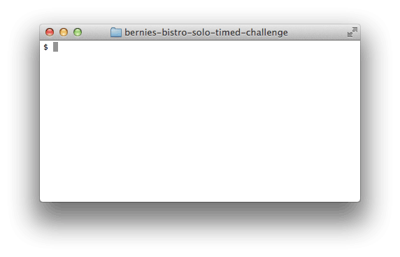

# Bernie's Bistro


## Summary
Congratulations! Your hard work modeling an orange grove for Fran the Farmer has paid off! She's referred you to her friend Bernie, the owner of Bernie's Bistro, a popular restaurant.

Bernie hired another programmer to build a computerized recipe system for the restaurant, but the programmer didn't finish the job before moving on to "an exciting opportunity in the virtual unicorn party space." Bernie needs someone to finish the restaurant's recipe system, and that person is you.

The other programmer was to have already completed the system, and Bernie would like a working program as soon as possible.  Complete the program to accomplish the use cases detailed below. Be wary of over-designing the program—your only job is to solve *these* problems, not to find other problems to solve.


### Recipe System Use Cases
  
*Figure 1*. Example usage, listing all recipes and displaying a specific recipe.

The recipe system should support two uses:  (1) users should be able to list all the recipes in the system and (2) users should be able to display the details for a specific recipe.  Figure 1 displays both of these uses and how Bernie would like to run the application.


## Releases
### Release 0: Find the Edges

When the user wants to list all recipes, the program should print something like this to the console:

```
111. Kale Burger
938. Poodle Cake (For your puppy!)
567. Peanut Butter Coffee Brownie
```

When the user wants to display a single recipe, it should print something like this to the console:

```
Recipe 111 - Kale Burger 
The Kale Burger is one of our best selling dishes!
It combines the nutritional value of kale with
the taste of cow!

Ingredients:
Kale, Cow

Preparation Instructions:
Preheat the oven to 500 degrees. Put in a cow. Wait 10 minutes.
Put in some kale. Take out cow and kale. Put on bun. Serve HOT!
```


Try to get the existing recipe system to raise errors by interacting with it via the command-line. Try all sorts of crazy things. The code is dirty and incomplete; you may have to clean it up.

Be systematic in your approach. Write down what you tried, what you thought would happen, and what actually happened.

Write down the main use cases for this program.  Then write tests that exercise those use cases. Use `recipe_system_spec.rb` for your test code.  For example, if you want to be able to look at a recipe, you might write some code like this:

```ruby
expect(recipe_book.find_recipe_by_id(567).name).to eq("Peanut Butter Coffee Brownie")
```


*Note:*  Your top priority is to create a functioning implementation of the described recipe system. Be mindful of how you spend your time.

There are three basic tests to fill in the spec file.  You are _not_ required to add your own tests in this challenge, but you're welcome to if you so desire. You have a limited amount of time, and tests alone cannot demonstrate your learning from the last two weeks. Focus on implementation first.


### Release 1: Implement the MVP
MVP == Minimum Viable Product.

Implement the use cases that were not completed or completed incorrectly by the previous consultant, as revealed by the errors you got the program to raise or the driver code you wrote.


### Release 2: Order Recipes in Alphabetical Order (Optional)
Congratulations on making it this far. Make sure you commit your code locally so you can revert back to *Release 1* if you need to. Then you can attack *Release 2*, if you would like to.

When you list the recipes now, the display should be something like ...

```
1. Kale Burger
2. Peanut Butter Coffee Brownie
3. Poodle Cake (For your puppy!)
```

The display number is different from the recipe's id.  How can you accommodate this new listing format?
